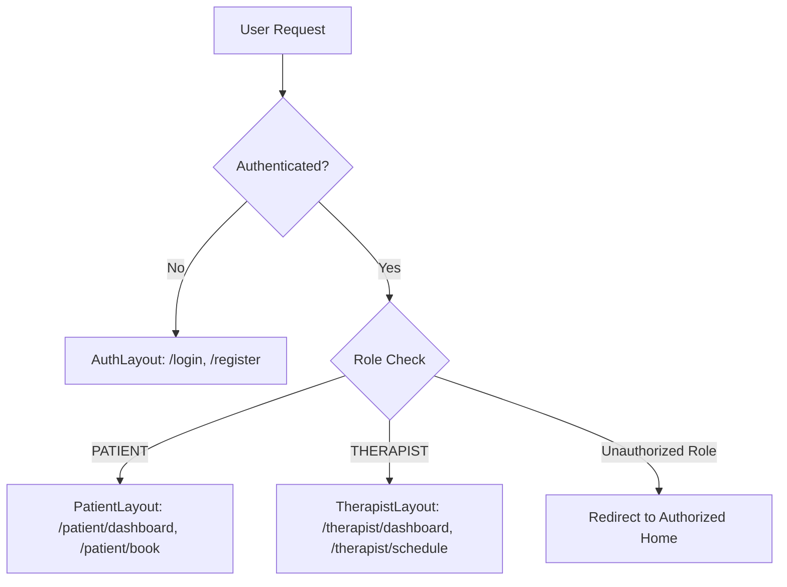

# Appointment Booking System — Production Frontend Architecture

A production-grade, enterprise-standard React 19 application built for an Appointment Booking System. Designed following high-scale engineering principles from Stripe, Airbnb, Uber, and Vercel.

---

## 🚀 Tech Stack

| Layer | Technology | Purpose |
| :--- | :--- | :--- |
| **Framework** | **React 19** + **TypeScript 5.8** | Modern UI library with strict zero-any typings |
| **Build Tool** | **Vite 8** | Ultra-fast ES module HMR & production bundler |
| **Styling** | **Tailwind CSS v4** + `@tailwindcss/vite` | Modern utility CSS framework with design tokens |
| **Routing** | **React Router v7** | Data Router with lazy code splitting & RBAC guards |
| **Data Fetching** | **TanStack Query v5** | Server state caching, stale-while-revalidate, & optimistic UI |
| **Global State** | **Zustand 5** | Persistent auth store (`localStorage`) & UI notification store |
| **Forms & Validation** | **React Hook Form** + **Zod** | Schema validation and high-performance form control |
| **HTTP Client** | **Axios 1.19** | Centralized client with request/response interceptors & refresh tokens |
| **Testing** | **Vitest** + **React Testing Library** | Sub-second unit & integration test runner |
| **Quality** | **ESLint 10**, **Prettier**, **Husky**, **lint-staged** | Pre-commit git hooks and code quality enforcement |

---

## 📐 Architecture & Feature-First Directory Structure

```text
src/
├── api/                  # Axios HTTP client instance & interceptors
├── app/                  # Application root entrypoint, QueryProvider, & App.tsx
├── components/           # Reusable UI primitives & feedback components
│   ├── feedback/         # ToastContainer, ErrorBoundary, PageSpinner, ErrorFallback
│   ├── layout/           # Navbar, Footer
│   └── ui/               # Button, Input, Card, Badge, Modal, Skeleton
├── config/               # Environment variables (Zod), routes, & query keys factory
├── features/             # Feature-First Business Modules (Encapsulated Domains)
│   ├── appointments/     # Booking wizard, time slot grid, slot hold timer, & lifecycle FSM
│   ├── auth/             # Login/Register schemas, forms, & mutations
│   ├── patient/          # Patient dashboard, stats grid, & upcoming session hero
│   └── therapist/        # Therapist agenda, shift rules form, & clinical notes modal
├── hooks/                # Shared application custom hooks
├── layouts/              # AuthLayout, PatientLayout, & TherapistLayout shells
├── pages/                # Route page containers lazy loading feature modules
├── routes/               # Router config, ProtectedRoute (RBAC), & PublicOnlyRoute
├── stores/               # Zustand authStore & uiStore
├── types/                # Global API & declaration typings
└── utils/                # Utility functions (cn class merger)
```

---

## 🔒 Role-Based Access Control (RBAC) & Routing

The system enforces strict role-based access control dividing user access between `PATIENT` and `THERAPIST` roles.



### Route Table
| Path | Guard | Allowed Roles | Description |
| :--- | :--- | :--- | :--- |
| `/login` | `PublicOnlyRoute` | Guest | User authentication login |
| `/register` | `PublicOnlyRoute` | Guest | Portal registration |
| `/patient/dashboard` | `ProtectedRoute` | `PATIENT` | Care summary, stats grid, & session agenda |
| `/patient/book` | `ProtectedRoute` | `PATIENT` | 3-step booking wizard with 5-minute slot holding |
| `/therapist/dashboard` | `ProtectedRoute` | `THERAPIST` | Daily client agenda & clinical progress notes |
| `/therapist/schedule` | `ProtectedRoute` | `THERAPIST` | Weekly shift rules & buffer time configuration |

---

## ⚡ Concurrency & Slot Holding Engine

To prevent double-booking collisions, selecting a time slot triggers an optimistic 5-minute hold lock (`useSlotHold`):

1. **Lock Acquisition**: Client calls `/slots/:id/hold` setting a 300,000ms TTL.
2. **Visual Urgency Banner**: Renders `<HoldCountdownBanner />` transitioning colors (Indigo ➔ Amber ➔ Rose).
3. **Auto-Release Graceful Degradation**: If timer reaches `00:00`, the hold auto-releases, notifies the user with a warning toast, and returns to slot selection.

---

## 🔄 State Machine & Lifecycle Transitions

Appointments follow a deterministic finite state machine (`canTransitionStatus`):

```text
[HELD] ──> [CONFIRMED] ──> [IN_PROGRESS] ──> [COMPLETED]
  │             │               │
  └──> [CANCELLED] ─────────────┴──────────> [NO_SHOW]
```

---

## 🛠️ Development & Script Commands

```bash
# Start local development server with HMR
npm run dev

# Run Vitest unit tests
npm run test

# Run TypeScript strict typecheck
npm run typecheck

# Run ESLint linter check
npm run lint

# Build production bundle
npm run build

# Preview production build locally
npm run preview
```

---

## 📜 Production Engineering Principles Enforced

1. **Zero Runtime Any Types**: All APIs, stores, and components utilize explicit TypeScript interfaces.
2. **Derived State over Effects**: Eliminates `useEffect` state syncing to prevent cascading render warnings (`react-hooks/set-state-in-effect`).
3. **Query Key Factory**: Centralizes query key generation in `QUERY_KEYS` to eliminate cache key collisions.
4. **Resilient Mock Fallbacks**: All feature APIs gracefully fallback to realistic mock datasets if backend endpoints are offline.
